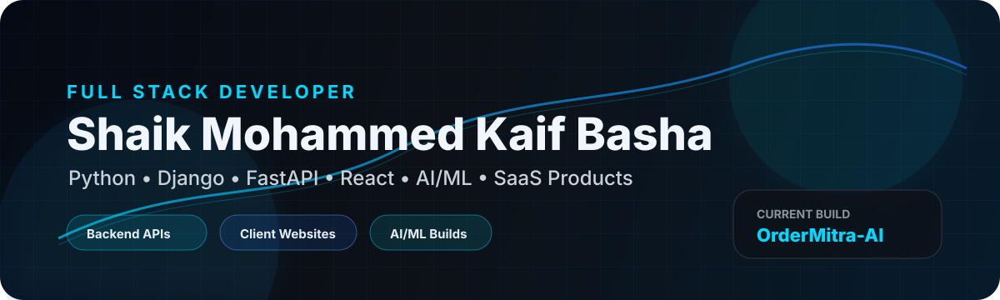
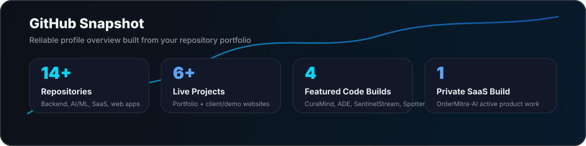

  

 

  

  
  
  
  

---

## 🚀 About Me

I am a **backend-focused Full Stack Developer** building real-world web apps, SaaS platforms, REST APIs, AI/ML projects, dashboards, and premium client websites.

- 🔭 Currently building **OrderMitra-AI** — an India-focused restaurant ordering SaaS
- 💼 Built multiple live client/demo projects with modern UI and business-focused flows
- 🧠 Focused on **Python, Django, FastAPI, React, PostgreSQL, Supabase, Docker, and AI/ML**
- 🎓 B.Tech CSE — **Artificial Intelligence & Machine Learning**, 2026
- 📍 Kurnool, Andhra Pradesh, India
- 📫 Reach me at **smohammedkaifbasha@gmail.com**

---

## 🔥 Current Build

### OrderMitra-AI

| Area | Details |
|---|---|
| Product Type | Restaurant ordering SaaS |
| Status | Private active build |
| Stack | Next.js, Supabase, PostgreSQL, TypeScript |
| Focus | Multi-tenant architecture, onboarding, tenant-safe database workflows, product roadmap |
| Goal | Help restaurants manage ordering, operations, and customer workflows directly |

---

## 💼 Featured Client / Live Projects

| Project | Category | Description | Live |
|---|---|---|---|
| **Gulshan Empire** | Real Estate | Luxury real-estate landing page with premium UI and lead-focused experience | [Visit](https://www.gulshan-empire.in/) |
| **Patrick R. Coyle** | Consulting | Executive consulting / CFO advisory website redesign | [Visit](https://patrick-rcoyle.vercel.app/) |
| **Codian UI** | Ecommerce UI | Mobile-first ecommerce product interface | [Visit](https://codian-ui.vercel.app/) |
| **Raydz Shoes** | Ecommerce | Streetwear shoe landing page with bold visual branding | [Visit](https://raydz-shoes.vercel.app/) |
| **Japan Tours** | Travel | Cinematic travel landing page with modern visual storytelling | [Visit](https://japan-website-work.vercel.app/) |
| **Portfolio** | Personal Brand | Developer portfolio showcasing my work and skills | [Visit](https://kaif0333-portfolio.vercel.app/) |

---

## 🧠 Featured Code Projects

| Project | Description | Tech |
|---|---|---|
| [**CuraMind AI**](https://github.com/Kaif0333/curamind-ai) | Healthcare diagnostic platform with multiple backend services, async processing, and secure medical workflows | Django, FastAPI, Flask, Celery, Redis, PostgreSQL, MongoDB, Docker |
| [**Adverse Drug Effect Detection**](https://github.com/Kaif0333/Adverse-Drug-Effect-Detection) | ML/NLP healthcare analytics project for detecting adverse drug effect signals from reviews | Python, Pandas, scikit-learn, TF-IDF, Random Forest, Streamlit |
| [**SentinelStream**](https://github.com/Kaif0333/SentinelStream) | FinTech transaction monitoring backend with authentication and protected APIs | FastAPI, PostgreSQL, SQLAlchemy, JWT |
| [**Spotter Backend Django**](https://github.com/Kaif0333/Spotter-Backend-Django) | Fuel route optimizer API using route geometry and greedy lookahead optimization | Django, DRF, Python, OSRM, Geopy |

---

## 🛠️ Tech Arsenal

### Backend

  

### Frontend

  

### Databases, Cloud & DevOps

  

### AI / ML / Data

  
  
  
  
  

### Tools

  

---

## 📊 Reliable GitHub Snapshot

  

 

  

---

## 🏆 Highlights

  
  
  
  

---

## 🟢 Contribution Animation

  <picture>
    <source media="(prefers-color-scheme: dark)" srcset="https://raw.githubusercontent.com/Kaif0333/Kaif0333/output/github-contribution-grid-snake-dark.svg" />
    <source media="(prefers-color-scheme: light)" srcset="https://raw.githubusercontent.com/Kaif0333/Kaif0333/output/github-contribution-grid-snake.svg" />
    
  </picture>

---

## 📬 Connect With Me

  
  
  

